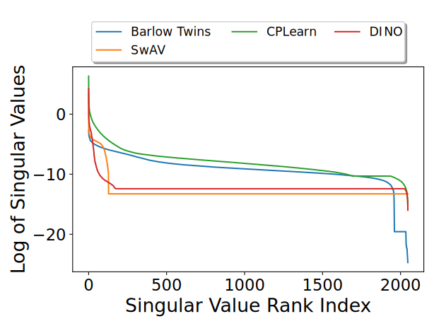

# CPLearn
Code accompanying the paper ["Collapse-Proof Non-Contrastive Self-Supervised Learning"](https://arxiv.org/pdf/2410.04959).

## A Few Notes
The code is implemented within the [solo-learn](https://github.com/vturrisi/solo-learn) library. More specifically, these files are of interest:
- [scripts/pretrain/cifar/cplearn.yaml](scripts/pretrain/cifar/cplearn.yaml)
- [solo/methods/cplearn.py](solo/methods/cplearn.py)

All other config files are shared with [solo-learn](https://github.com/vturrisi/solo-learn).

## Prerequisites
```bash
pip install -r requirements.txt
wandb login <API_KEY>
```

## Reproducing ResNet-18 Experiments
### CPLearn Pretraining and Online Linear Probing Eval
```bash
python3 main_pretrain.py \
    # path to training script folder
    --config-path scripts/pretrain/cifar/cplearn.yaml/ \
    # training config name
    --config-name cplearn.yaml
```
Pre-training on a single A100 GPU takes around 8 hours.

### CPLearn Clustering Eval
```bash
python3 main_clustering.py --dataset cifar10 --train_data_path datasets --pretrained_checkpoint_dir a_checkpoint_dir_containing_a_single_checkpoint
```
Results are stored in the selected checkpoint dir

### CPLearn Dimensional and Intra-cluster Collapse Eval
First, extract the embeddings and store them in a newly created folder called *embeddings*
```bash
python3 main_embeddings.py --dataset cifar10 --train_data_path datasets --pretrained_checkpoint_dir a_checkpoint_dir_containing_a_single_checkpoint
```

Second, run the collapse analysis
```bash
python3 main_collapses.py
```
Results are stored in the *embeddings* folder. Below, you can find the produced figures.

| Dimensional Collapse | Intra-Cluster Collapse |
|----------------------------|----------------------------|
|  |  |

## Citation
If you use the code or any result, please use the following reference:
```bibtex
@inproceedings{sansone2025collapses,
  author    = {Emanuele Sansone and Tim Lebailly and Tinne Tuytelaars},
  title     = {{Collapse-Proof Non-Contrastive Self-Supervised Learning}},
  booktitle = {International Conference on Machine Learning},
  year      = {2025}
}
```
